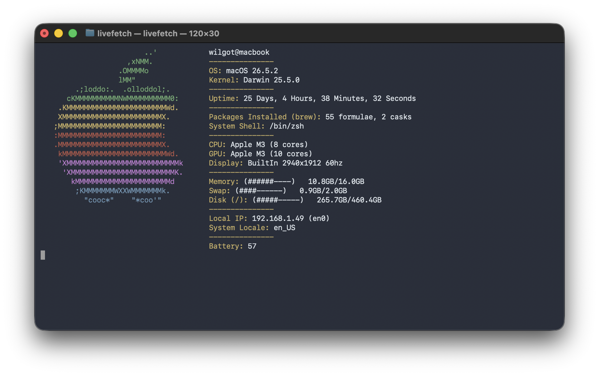

<div align="center">
  <h1>livefetch</h1>

  <p>A TUI system information tool with live-updating modules.<br>
</div>



---
<br>

## Relationship to fastfetch

livefetch is inspired by fastfetch and other system information tools, but it is an independent project.
The codebase was developed separately and does not contain code from fastfetch.

## Features

- Live-updating system information.

- Displays system modules including CPU, GPU, battery status, memory, storage, network, uptime, and more.

- Configurable modules and layout.

- Customizable ASCII logos.

- Lightweight and written in C.

## Installation
### Installation with homebrew
```sh
# Add livefetch repository
brew tap WilGulf/livefetch

# Install livefetch
brew install livefetch
```
### Installation from source code<br>
```sh
# Clone and cd into the source code folder
git clone https://github.com/WilGulf/livefetch.git
cd livefetch

# Compile the program
make

# Install the program
sudo make install
```
> **Note:** If `PREFIX` is not specified, `make install` installs to `/usr/local` by default.<br>
> **Note:** If using a prefix, that prefix needs to be used on both the 'make' and 'make install' commands.

## How it works
Livefetch is written in C and using ncurses for rendering in terminal.
System information is fetched from platform-specific APIs and refreshed while the program is running.
The config is written in my own simple format supporting: keys, values and tables. 
Every time the program is run the config gets parsed and the program behaves after the config.

## Acknowledgements

Inspired by system information tools such as fastfetch and neofetch.

Uses:
- ncurses for terminal rendering.

