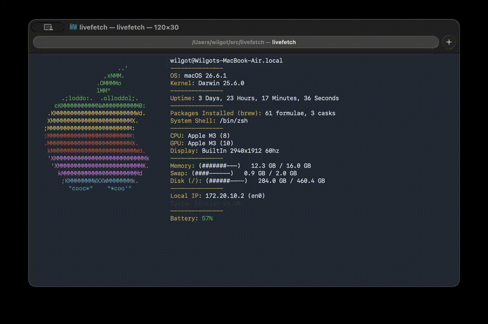

<div align="center">
  <h1>livefetch</h1>

  <p>A TUI system information tool with live-updating modules for macOS and Linux.<br>
</div>

<div align="center">
  
  
  
  
</div>



---
<br>

## Relationship to fastfetch

livefetch is inspired by fastfetch and other system information tools, but it is an independent project.
The codebase was developed separately and does not contain code from fastfetch.

## Features

- Live-updating system information.

- Displays system modules including CPU, GPU, battery status, memory, storage, network, uptime, and more.

- Configurable modules and layout.

- Customizable ASCII logos.

- Lightweight and written in C.

## Installation

<details>
<summary><strong>Installation with homebrew</strong></summary>

```sh
# Add livefetch repository
brew tap WilGulf/livefetch

# Install livefetch
brew install livefetch
```

</details>
<br>

<details>
<summary><strong>Installation on Debain/Ubuntu based systems</strong></summary>

```sh
# Ensure needed tools are installed
apt update && apt install gnupg curl

# Add livefetch repository
curl -fsSL https://github.com/WilGulf.gpg | sudo gpg --batch --yes --dearmor -o /usr/share/keyrings/wilgulf-livefetch.gpg

echo "deb [signed-by=/usr/share/keyrings/wilgulf-livefetch.gpg] https://wilgulf.github.io/apt-livefetch stable main" | sude tee /etc/apt/sources.list.d/livefetch.list

# Install livefetch
apt update && apt install livefetch
```

</details>
<br>

<details>
<summary><strong>Installation on RHEL/fedora based systems</strong></summary>

```sh
# Add livefetch repository
sudo dnf config-manager addrepo --from-repofile=https://wilgulf.github.io/rpm-livefetch/livefetch.repo

# Install livefetch
sudo dnf install livefetch
```

</details>
<br>

<details>
<summary><strong>Installation on Arch based systems</strong></summary>

```sh
# Install needed tools
sudo pacman -S --needed base-devel

# Clone and cd into the source code folder
git clone https://github.com/WilGulf/livefetch.git
cd livefetch

# Install the program
makepkg -si
```

</details>
<br>

<details>
<summary><strong>Installation from source code</strong></summary>

```sh
# Clone and cd into the source code folder
git clone https://github.com/WilGulf/livefetch.git
cd livefetch

# Compile the program
make

# Install the program
sudo make install
```
> **Note:** If `PREFIX` is not specified, `make install` installs to `/usr/local` by default.<br>
> **Note:** If using a prefix, that prefix needs to be used on both the 'make' and 'make install' commands.

</details>
<br>

## Run the program
To run livefetch simply type livefetch in your terminal and then enter.
```sh
livefetch
```

## Running portable binaries
Run Livefetch directly from the extracted archive:
```sh
./bin/livefetch
```

## Configuration

Livefetch uses a simple configuration format supporting keys, values, and tables.

The default configuration file is located at: /usr/local/share/livefetch/default.conf <br>
When installed through Homebrew, the configuration file is instead located at: $HOMEBREW_PREFIX/share/livefetch/default.conf

You can also use a custom configuration file:

```sh
livefetch --config path/to/your/config
```

## How it works
Livefetch is written in C and using ncurses for rendering in terminal.
System information is fetched from platform-specific APIs and refreshed while the program is running.
The config is written in my own simple format supporting: keys, values and tables. 
Every time the program is run the config gets parsed and the program behaves after the config.

## Acknowledgements

Inspired by system information tools such as fastfetch and neofetch.

Uses:
- ncurses for terminal rendering.


## Support the Project

If you find this project useful, consider giving the repository a star ⭐️, or even fork it if you want!

Stars and forks helps to show maintainers that there is demand for livefetch to be included in official repositories.
